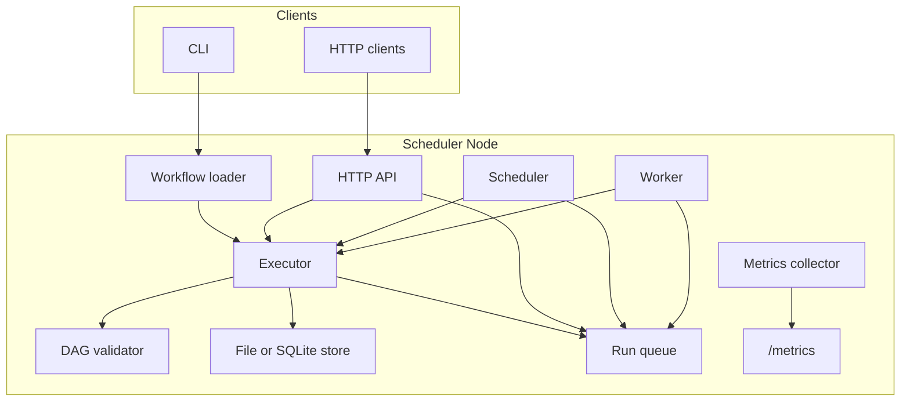

# Distributed Workflow Scheduler

*Distributed Workflow Scheduler* is a Go-based workflow engine for JSON and
YAML workflows. It runs dependency-aware DAGs, exposes an HTTP API, supports
scheduled and async execution, persists state to file or SQLite, and includes
worker leasing, compensation, scoped API tokens, and Prometheus-compatible
metrics.

## Features

| Area | What's implemented |
| --- | --- |
| **Execution** | DAG validation, dependency ordering, `maxConcurrency`, task outputs, run status aggregation |
| **Workflow model** | JSON/YAML loading, task inputs, timeouts, retries, `runAfter`, `failFast`, `allowFailure` |
| **Routing** | `on_success`, `on_failed`, `output_contains`, `${task.output}`, `${task.status}` |
| **Recovery** | Reverse-order compensation when `compensateOnFailure` is enabled |
| **Scheduling** | Interval and cron schedules, `runOnStartup`, overlap control, leader lock, persisted registrations |
| **Async jobs** | Queue-backed runs, worker leasing, cancellation, dead-letter, replay, retention cleanup |
| **Storage** | File-backed mode and SQLite-backed durable shared state |
| **API** | Workflow CRUD, run control, schedules, jobs, pagination, filters, envelope responses |
| **Security** | Optional *admin*, *read*, and *write* API tokens |
| **Monitoring** | `/metrics`, `/health`, `/ready`, and job stats |

## Architecture



The *executor* is the core. CLI, scheduler, API, and worker modes all feed
work into the same execution path, so retries, conditions, timeouts, and
compensation behave consistently. In SQLite mode, API and worker processes
share durable job state.

## Project layout

```text
cmd/
  orchestrator/     # run, schedule, serve, worker
internal/
  actions/          # built-in actions
  api/              # HTTP API
  domain/           # workflows, runs, jobs, interfaces
  engine/           # DAG validation and execution
  queue/            # in-memory queue
  scheduler/        # interval/cron scheduling
  store/            # memory, file, and SQLite storage
  telemetry/        # metrics collector
  worker/           # async job worker
pkg/
  utils/            # IDs and workflow loader
examples/           # sample workflows
docs/               # OpenAPI scaffold
tests/              # workflow-level tests
TESTING.md          # detailed scenarios
```

## Build and run

Requires Go 1.25+.

```powershell
go build ./...
```

Run once:

```powershell
go run ./cmd/orchestrator -mode run -workflow examples/sample_workflow.json -data-dir data
```

Run on a schedule:

```powershell
go run ./cmd/orchestrator -mode schedule -workflow examples/sample_workflow.json -data-dir data -interval 10s -run-for 1m
```

Start the API:

```powershell
go run ./cmd/orchestrator -mode serve -workflow examples/sample_workflow.json -data-dir data -api-addr :8080 -api-token my-token
```

Run a worker with SQLite:

```powershell
go run ./cmd/orchestrator -mode worker -workflow examples/sample_workflow.json -store-backend sqlite -sqlite-path data/orchestrator.db -worker-id worker-1
```

## Testing

Automated tests cover executor behavior, graph validation, scheduling, API
flows, queue lifecycles, SQLite persistence, worker drain/cancel behavior, and
workflow loading.

```powershell
go test ./...
go test -race ./...
go test ./internal/api -v
go test ./internal/store -v
```

CI-style checks:

```powershell
gofmt -l .
go test ./...
go test ./internal/api -run TestDistributedAsyncLifecycleSmoke -count=1
```

More detail is in *TESTING.md*.

## Modes

| Mode | Responsibility |
| --- | --- |
| `run` | Execute one workflow and print the run record |
| `schedule` | Trigger workflows on interval or cron |
| `serve` | Expose the API, schedules, and queue control |
| `worker` | Lease and execute async jobs |

Example async setup:

```powershell
# Terminal 1
go run ./cmd/orchestrator -mode serve -workflow examples/sample_workflow.json -store-backend sqlite -sqlite-path data/orchestrator.db -api-addr :8080 -api-token my-token

# Terminal 2
go run ./cmd/orchestrator -mode worker -workflow examples/sample_workflow.json -store-backend sqlite -sqlite-path data/orchestrator.db -worker-id worker-1
```

## Key flags

| Flag | Default | Description |
| --- | --- | --- |
| `-mode` | `run` | `run`, `schedule`, `serve`, or `worker` |
| `-workflow` | `examples/sample_workflow.json` | Workflow JSON or YAML path |
| `-store-backend` | `file` | `file` or `sqlite` |
| `-data-dir` | `data` | File-store directory |
| `-sqlite-path` | `data/orchestrator.db` | SQLite database path |
| `-api-addr` | `:8080` | HTTP API address |
| `-api-token` | empty | Full-access token |
| `-api-read-token` | empty | Read-only token |
| `-api-write-token` | empty | Write token |
| `-interval` | `15s` | Scheduler interval |
| `-cron` | empty | Cron expression |
| `-worker-id` | empty | Worker identity |

## API surface

**Workflows:** `GET /workflows`, `GET /workflows/{id}`, `POST /workflows`, `PUT /workflows/{id}`, `PATCH /workflows/{id}`  
**Runs:** `POST /runs`, `GET /runs`, `GET /runs/{id}`, `DELETE /runs/{id}`  
**Jobs:** `GET /jobs`, `GET /jobs/{id}`, `GET /jobs/stats`, `GET /jobs/history/{id}`, `GET /jobs/dead-letter`, `DELETE /jobs/{id}`, `POST /jobs/cancel`, `POST /jobs/requeue`, `POST /jobs/purge`  
**Schedules:** `GET /schedules`, `POST /schedules`, `DELETE /schedules/{workflowId}`  
**Health:** `GET /health`, `GET /ready`, `GET /metrics`

## Example workflow

```json
{
  "id": "wf-order-pipeline",
  "maxConcurrency": 3,
  "compensateOnFailure": true,
  "tasks": [
    {
      "id": "validate-order",
      "action": "print",
      "input": { "message": "Order validated" }
    },
    {
      "id": "reserve-inventory",
      "action": "randomFail",
      "dependsOn": ["validate-order"],
      "condition": "on_success:validate-order",
      "retryPolicy": { "maxAttempts": 3, "backoffBase": "200ms" }
    }
  ]
}
```

## Notes

- Workflows are validated before execution, including cycle checks.
- API, scheduler, and worker modes all use the same executor semantics.
- SQLite mode is the right choice when API and worker run as separate processes.
- API list endpoints return arrays by default and envelope metadata only when requested.